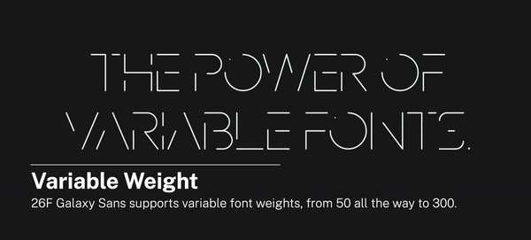
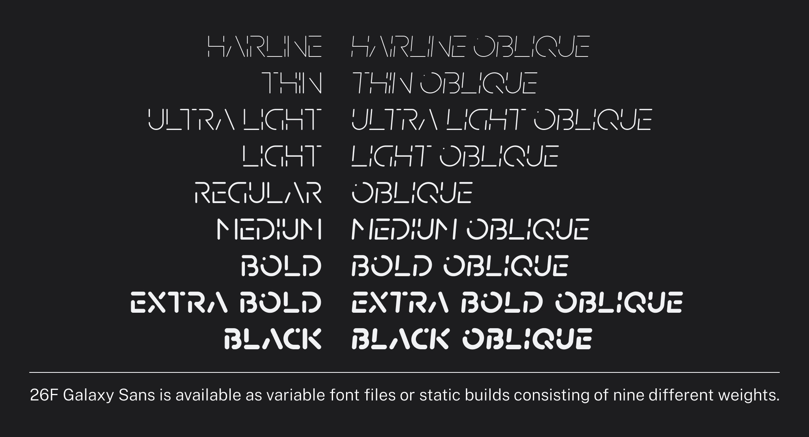
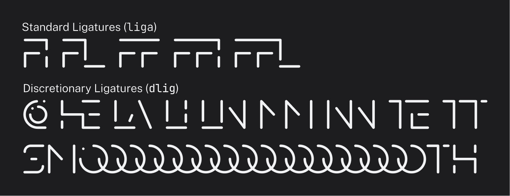

# 26F Galaxy Sans


[Click here to view the Simplified Chinese Version 点击这里来阅读简中版本](README_SC.md)

26F Galaxy Sans is an open-source variable typeface featuring elements from space and the universe. It is designed for the block stacking game [Techmino Galaxy](https://github.com/26F-Studio/Techmino_Galaxy) (which is currently under development).

## Features

### Variable Font

26F Galaxy Sans is available as variable font files with a weight axis ranging from 50 to 300.



### Multiple Weights

26F Galaxy Sans also supports multiple weights for software that doesn’t support variable fonts. The static builds include nine different weights for a variety of use.



### All-Caps Ligatures

26F Galaxy Sans also have all-caps ligatures. Simply enable the `liga` and `dlig` OpenType Feature to use them.




## Build from Source

**NB: I used a Glyphs-specific feature called auto stroke in order to make editing easier. However, it seems that `gftools` cannot understand this new feature. Therefore, it is highly recommended to use the original Glyphs 3 app to build the font files. If you still want to build the font files using `gftools`, make sure to use the Glyph files in the `./build` directory. I would export the flattened Glyphs and UFO files on a regular interval so please stay tuned.**

You can either build the fonts using the Glyphs app (or other font editing programs) directly, or you can choose to build them in the command line using the Google Font Tools (`gftools`). You have to install Python 3.7 or later to use `gftools`.

1. Install `gftools` by executing the following command:
   
   ```
   $ pip install gftools
   ```

2. Navigate to `./.github/workflows/` in the command line.

3. Execute the following command:
   
   ```
   gftools builder config.yaml
   ```

4. Find the compiled fonts in the `.github/fonts` folder.

### Notes for non-Glyphs users

It is strongly recommended to use original Glyphs files whenever possible as it preserves the original auto strokes for easier editing (though some glyphs are decomposed in order to avoid compatibility issues). 

But if that is not possible for you, you can also use the exported UFO (unified font object) files as an alternative choice. However:

- All the auto strokes and other Glyphs-specific smart stuff are decomposed to outlines in UFO files.

- Because of this, it is not possible for me to directly save the Glyphs files as UFO. To export UFO files, it is necessary to decompose all the smart stuff manually and export each master into an independent UFO file, so UFO files may not update as timely as the Glyphs files.

- Since UFO does not support multiple masters, you need to interpolate using specific programs in order to get multiple weights and variable fonts by combining the provided masters in UFO.

- All the user-friendly glyph names are converted to production names (`uni####`).

- The actual weights of the exported static font files are as follows if you want to generate all weights included in the distro:
  
  | **Weights** | **Actual Stem widths** | **Weight Class (Recommended)** |
  | ----------- | ---------------------- | ------------------------------ |
  | *Hairline*  | *50*                   | *50*                           |
  | Thin        | 65                     | 100                            |
  | Ultra Light | 83                     | 200                            |
  | Light       | 95                     | 300                            |
  | *Regular*   | *120*                  | *400*                          |
  | Medium      | 159                    | 500                            |
  | Bold        | 206                    | 600                            |
  | Extra Bold  | 257                    | 700                            |
  | *Black*     | *300*                  | *800*                          |
  
  *The weights in italics represent the weights of the original masters.*

## License

26F Galaxy Sans is under a [SIL Open Font License, Version 1.1](https://github.com/26F-Studio/26F-Sans/blob/main/OFL.txt). You can use, modify, and redistribute the compiled fonts and the source files free of charge and you do not need to attribute to 26F Studio (But we would appreciate that if you do so).

The [build.yml](https://github.com/26F-Studio/26F-Sans/blob/main/.github/workflows/build.yml) files were adapted from the [JetBrains Mono Repository](https://github.com/JetBrains/JetBrainsMono/blob/master/.github/workflows/build-fonts.yml), which was under a [Apache 2.0 License](https://www.apache.org/licenses/LICENSE-2.0).

The other part of the source code in this repository is under a [MIT License](https://github.com/26F-Studio/26F-Sans/blob/main/MIT.txt). 

## Credits

* Type Design and Testing — C₂₉H₂₅N₃O₅


