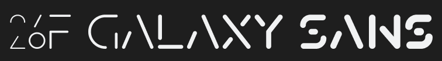

# 26F Galaxy Sans



# ***注意: 此字体目前仍在开发中完成度不高, 可能有严重bug, 在开发完成之前不建议使用.***

26F Galaxy Sans是一款开源的可变字体, 灵感来自宇宙航行和太空元素. 这款字体是为了方块游戏[Techmino Galaxy](https://github.com/26F-Studio/Techmino_Galaxy)(目前也仍在开发中)而设计的.

## 特性 (计划)

- 多母版和字重

- 多语言支持

- 可变字体

- 一些OpenType Features

- 等等.

## 从源码构建

你可以使用Glyphs(或其他字体编辑软件)来直接构建本字体, 或使用命令行工具Google Font Tools (`gftools`). 你需要Python 3.7或之后的Python来使用`gftools`.

1. 执行以下代码来安装 `gftools` :
   
   ```
   $ pip install gftools
   ```

2. 在命令行界面中移动到 `./.github/workflows/`;

3. 执行以下命令:
   
   ```
   gftools builder config.yaml
   ```

4. 在 `fonts` 目录中找到构建好的字体文件.

## 许可

26F Galaxy Sans使用 [SIL开源字体许可, V1.1](https://github.com/26F-Studio/26F-Sans/blob/main/OFL.txt). 你可以免费使用､ 修改和重新分发编译的字体和源文件, 而无需提及作者本人 (但你也可以这么做).

Build.yml文件改编自[JetBrains Mono仓库](https://github.com/JetBrains/JetBrainsMono/blob/master/.github/workflows/build-fonts.yml), 其使用[Apache 2.0协议](https://www.apache.org/licenses/LICENSE-2.0).

本仓库其他部分代码使用[MIT 协议](https://github.com/26F-Studio/26F-Sans/blob/main/MIT.txt).

# 作者

- 字体设计和测试: C₂₉H₂₅N₃O₅ 
