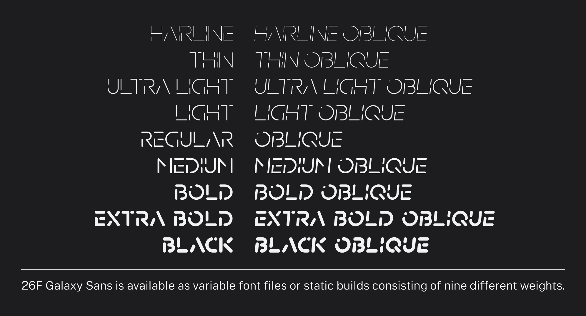
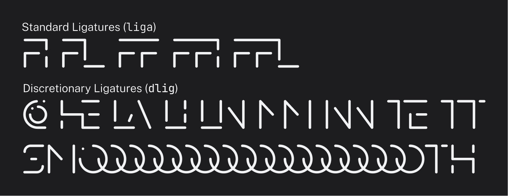
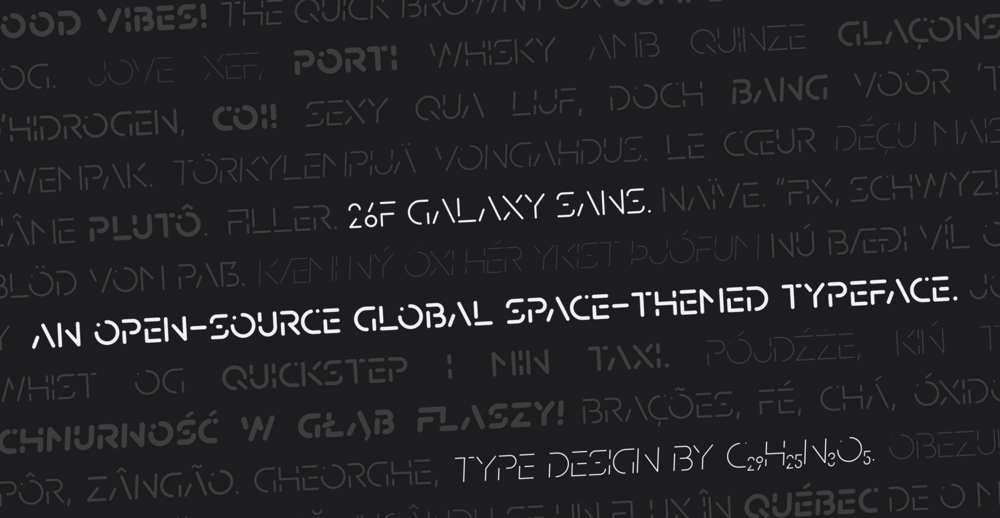

# 26F Galaxy Sans


26F Galaxy Sans是一款开源的可变字体, 灵感来自宇宙航行和太空元素. 这款字体是为了方块游戏[Techmino Galaxy](https://github.com/26F-Studio/Techmino_Galaxy)(目前也仍在开发中)而设计的.

## 特性

### 可变字体

26F Galaxy Sans提供可变字体文件, 字重范围为50\~300.


### 多种字重

26F Galaxy Sans为不支持可变字体的软件提供多字重的静态字体文件. Static Build包括9种不同的字重, 可用于各种用途.



### 全大写连字

26F Galaxy Sans也支持全大写连字. 只需启用`liga`和`dlig`OpenType特性即可使用.




## 从源码构建

**注意: 在制作本套字体过程中, 我使用了一个Glyph的特有功能(auto stroke, 自动笔划)来让编辑更简易; 但是似乎`gftools`无法读取这种新格式. 因此, 强烈建议使用原版Glyphs 3软件来导出字体文件. 如果你还是想使用`gftools`来构建字体文件的话, 请确认使用`./build`目录下的Glyphs文件. 我会定期导出轮廓化的Glyphs和UFO文件, 所以请持续关注.**

你可以使用Glyphs(或其他字体编辑软件)来直接构建本字体, 或使用命令行工具Google Font Tools (`gftools`). 你需要Python 3.7或之后的Python来使用`gftools`.

1. 执行以下代码来安装 `gftools` :
   
   ```
   $ pip install gftools
   ```

2. 在命令行界面中移动到 `./.github/workflows/`;

3. 执行以下命令:
   
   ```
   gftools builder config.yaml
   ```

4. 在 `.github/fonts` 目录中找到构建好的字体文件.

## 对于非Glyphs用户

强烈使用尽可能原始Glyphs文件来进行编辑和导出, 因为这些文件保留了原本的auto stroke以便于后期处理(尽管部分字符因为兼容性问题已被转换成纯轮廓).

但是如果出于某些原因不能使用Glyphs文件的话, 你也可以使用导出的UFO(Unified Font Object)文件, 但是请注意:

- 所有的auto stroke和其他Glyphs专有的智能部件已被转换为普通轮廓.

- 正因如此, Glyphs文件无法直接保存为UFO文件. 在导出时, 每一个母版都先被转换然后单独导出为独立的UFO文件, 因此UFO文件可能不会有Glyphs文件更新的及时.

- 由于UFO文件不支持多母版技术, 所以你可能需要使用特定程序来手动插值来获得多字重和可变字体.

- 所有“用户友好”的字符形名称已被转换为产品名称(`uni####`).

- 以下是生成的静态build中字体的字重表:
  
  | **字重**      | **实际字干宽度** | **字重等级 (Weight Class, 推荐值)** |
  | ----------- | ---------- | ---------------------------- |
  | *Hairline*  | *50*       | *50*                         |
  | Thin        | 65         | 100                          |
  | Ultra Light | 83         | 200                          |
  | Light       | 95         | 300                          |
  | *Regular*   | *120*      | *400*                        |
  | Medium      | 159        | 500                          |
  | Bold        | 206        | 600                          |
  | Extra Bold  | 257        | 700                          |
  | *Black*     | *300*      | *800*                        |

*斜体的字重值代表原始母版的字重。*

## 许可

26F Galaxy Sans使用 [SIL开源字体许可, V1.1](https://github.com/26F-Studio/26F-Sans/blob/main/OFL.txt). 你可以免费使用､ 修改和重新分发编译的字体和源文件, 而无需提及作者本人 (但你也可以这么做).

Build.yml文件改编自[JetBrains Mono仓库](https://github.com/JetBrains/JetBrainsMono/blob/master/.github/workflows/build-fonts.yml), 其使用[Apache 2.0协议](https://www.apache.org/licenses/LICENSE-2.0).

本仓库其他部分代码使用[MIT 协议](https://github.com/26F-Studio/26F-Sans/blob/main/MIT.txt).

# 作者

- 字体设计和测试: C₂₉H₂₅N₃O₅ 


